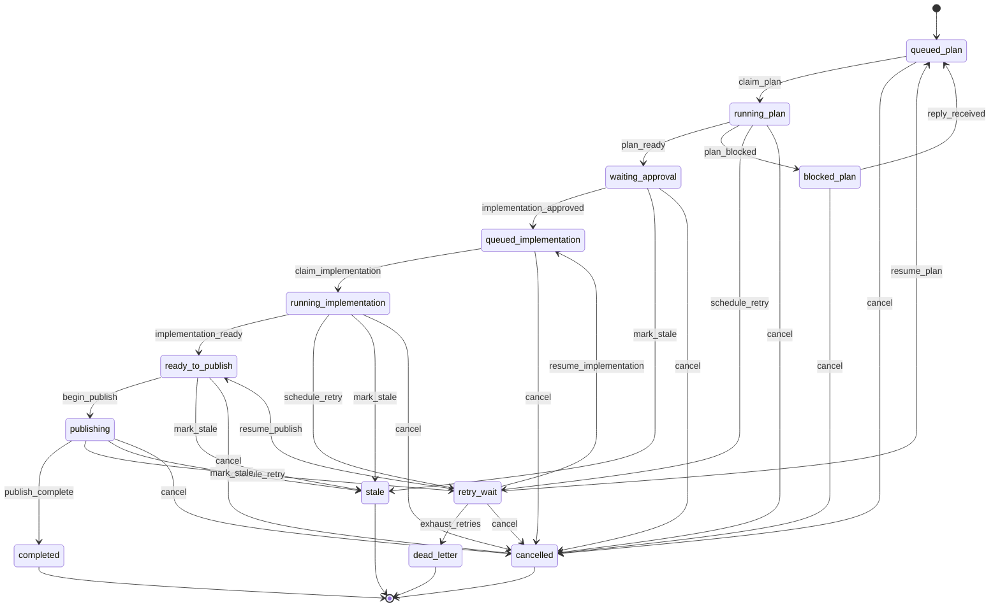

# Bot Job State Machine

This file is generated by `osc-agent architecture render-state-machine`.

| From | Event | To |
|---|---|---|
| `queued_plan` | `claim_plan` | `running_plan` |
| `running_plan` | `plan_ready` | `waiting_approval` |
| `running_plan` | `plan_blocked` | `blocked_plan` |
| `blocked_plan` | `reply_received` | `queued_plan` |
| `waiting_approval` | `implementation_approved` | `queued_implementation` |
| `queued_implementation` | `claim_implementation` | `running_implementation` |
| `running_implementation` | `implementation_ready` | `ready_to_publish` |
| `ready_to_publish` | `begin_publish` | `publishing` |
| `publishing` | `publish_complete` | `completed` |
| `running_plan` | `schedule_retry` | `retry_wait` |
| `running_implementation` | `schedule_retry` | `retry_wait` |
| `publishing` | `schedule_retry` | `retry_wait` |
| `retry_wait` | `resume_plan` | `queued_plan` |
| `retry_wait` | `resume_implementation` | `queued_implementation` |
| `retry_wait` | `resume_publish` | `ready_to_publish` |
| `retry_wait` | `exhaust_retries` | `dead_letter` |
| `waiting_approval` | `mark_stale` | `stale` |
| `running_implementation` | `mark_stale` | `stale` |
| `ready_to_publish` | `mark_stale` | `stale` |
| `publishing` | `mark_stale` | `stale` |
| `queued_plan` | `cancel` | `cancelled` |
| `running_plan` | `cancel` | `cancelled` |
| `blocked_plan` | `cancel` | `cancelled` |
| `waiting_approval` | `cancel` | `cancelled` |
| `queued_implementation` | `cancel` | `cancelled` |
| `running_implementation` | `cancel` | `cancelled` |
| `ready_to_publish` | `cancel` | `cancelled` |
| `publishing` | `cancel` | `cancelled` |
| `retry_wait` | `cancel` | `cancelled` |
